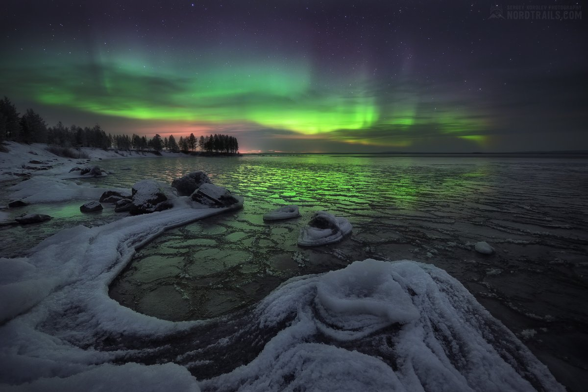

## Немного о себе
Я родилась на крайнем севере, в прекрасном и суровом городе Мурманске. Характер мне достался по наследству от родных мест, и, в целом, скорее помогает мне в профессии и любимом деле.

Свою жизнь я посвятила детям - работаю в частной школе старшим куратором. Я руковожу всем учебным процессом и помогаю подросткам органично перейти из периода школьного в университетский. В один прекрасный день я поняла, что люблю не только детей, но и горы. Однажды я купила билет Спб-Минеральные воды, чтобы взойти на Эльбрус, и началось... 